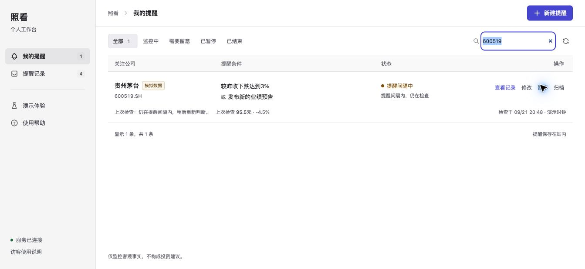
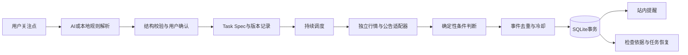

# 照看 · 投资监控与风险雷达

面向有自选股和明确研究关注点、无法全天盯盘的 A 股个人投资者。把自然语言转成可检查、可修改的监控规则，持续说明任务是否正常，以及为什么提醒、为什么没有提醒。

**体验方式：** [打开产品](https://intention-water-assistant-comparative.trycloudflare.com) · [源码仓库](https://github.com/wousp112/zhaokan-investment-radar) · [v1.0.0历史视频](https://github.com/wousp112/zhaokan-investment-radar/releases/download/v1.0.0/demo.mp4) · [验证说明](TESTING_AND_EVAL.md) · [AI 使用记录](AI_USAGE_AND_VERIFICATION.md)

公开体验当前使用本机服务与临时 Cloudflare Tunnel，地址依赖主机及通道持续运行。正式长期托管方案见 [部署说明](docs/DEPLOYMENT.md)。演示模式与真实数据模式相互隔离；界面不会把模拟行情显示成真实行情。



## 先试这条任务

> 未来两周帮我盯住贵州茅台：日内跌幅达到3%，或者发布新的业绩预告，就提醒我。同一件事别反复提醒；如果监控出了问题，也告诉我。

点击“新建提醒”，选择“跌幅 + 业绩预告”示例和“演示情景（模拟数据）”，再点击“查看规则”。核对公司、条件与结束时间后，点击“开始监控”。打开侧栏“演示体验”，依次测试下跌、新公告、行情超时和恢复；点击任务的“查看记录”检查逐条件依据。

真实数据模式调用已配置的扶摇行情及 iFinD 公告服务。没有凭据、来源失败或数据不可用时，会显示相应状态，不切换为模拟行情。提醒保存在站内，当前没有邮件、短信或浏览器后台推送。

使用步骤见 [用户指南](docs/USER_GUIDE.md)，界面对标和本轮验证见 [改版验收](docs/REDESIGN_ACCEPTANCE.md)。v1.0.0视频保留改版前画面，尚未重录。

## 已实现的闭环

| 环节 | 用户可操作的能力 | 对应实现 |
| --- | --- | --- |
| 关注点变规则 | 自然语言解析、标的确认、结构化规则预览、数值及 JSON 编辑 | `app/core/nlp_compiler.py`、`app/models/dsl.py` |
| 统一任务模型 | 价格、涨跌幅、公告、日历、量比；平铺的 AND / OR 组合 | `TaskSpec`、`Condition` |
| 持续运行 | 检查间隔、激活、暂停、自动休市静默、冷却、到期、归档 | `app/core/scheduler.py` |
| 防止打扰 | 按交易日与规则版本去重价格，按事件指纹去重公告；冷却中继续检查 | `state_machine.py`、`audit_logger.py` |
| 中断与修改 | 持久化恢复、待提醒公告保留、规则版本、乐观锁、历史规则恢复为新版本 | SQLite 与任务接口 |
| 可解释性 | 条件值、比较关系、来源、时间、规则版本、触发与未触发原因；证据导出 | 审计抽屉与 `/audit-trail`、`/export` |
| 异常处理 | 超时、服务错误、限流、过期、冲突分别处理；不受影响的条件继续检查 | `app/adapters/` |

日历条件支持明确的带时区时间，可通过 AI 解析或规则 JSON 设置；本地解析器不猜测复杂日历表达。量比使用统一条件模型，但真实行情快照没有该指标，当前只在演示模式提供有效量比数据。

## 本地启动

本机运行支持 macOS 和 Linux，需要 Python 3.11 或以上版本。Windows 可使用 Docker。无需前端构建工具。

```bash
python3 -m venv .venv
source .venv/bin/activate
pip install -r requirements.txt
cp .env.example .env
python -m uvicorn app.main:app --host 127.0.0.1 --port 8000 --workers 1
```

打开 `http://127.0.0.1:8000`。不配置任何外部凭据也能完整运行演示模式和本地规则解析。外部模型与数据接入属于可选配置，不影响演示规则引擎运行。

需要复现本次依赖版本时，可改用 `pip install -r requirements-lock.txt`。该文件记录本轮运行与测试环境中的 Python 包版本，不包含浏览器或系统 FFmpeg。

同一数据目录只允许一个服务进程。文件锁阻止两个调度器同时运行，`--workers` 必须为 `1`。默认数据目录是项目内 `data/`，包含 SQLite 数据库、WAL 和运行锁；不要将它提交到仓库。

```bash
pip install -r requirements-dev.txt
python -m pytest -q --junitxml=artifacts/pytest-results.xml
python scripts/test_process_recovery.py
node --test tests/test_presentation.cjs
```

浏览器测试额外需要 Playwright 和 Chrome；实际脚本见 `scripts/browser_acceptance.py`。真实模型评测见 `scripts/evaluate_ai.py`，会调用已配置模型并产生 API 使用量。

## 架构与关键选择



AI 只参与关注点提取。行情计算、比较、状态流转和提醒发送由程序执行。即使模型输出格式正确，也必须通过任务模型校验；用户确认后才创建任务。无法支持的指标、未知标的和混合歧义表达会要求澄清，防止静默遗漏用户要求。

任务状态、审计记录、提醒和去重指纹在同一个 SQLite 事务中保存。程序中断时，要么完整提交，要么整体回滚。服务重启后保留冷却、已提醒指纹和待提醒公告；恢复检查会留下记录。

| 存储路径 | 适用情境 | 本项目取舍 |
| --- | --- | --- |
| 单文件 JSON | 很小的离线演示，容易查看 | 多文件原子性和并发更新较难保障，本次未采用 |
| SQLite WAL | 单机、小规模长期任务，部署依赖少 | 当前实现；用事务保护任务、审计和站内消息的一致性 |
| PostgreSQL + 工作队列 | 多实例部署、并发规模较大 | 后续扩展，需要任务租约与独立调度进程，本次未实现 |

### 为什么使用三种判断结果

每条条件返回“满足”“未满足”“无法判断”。例如价格接口失效时，价格条件为“无法判断”；公告仍可独立满足 OR 规则。AND 规则只有全部满足才能提醒。数据错误不会被转换成“条件未满足”。

### 冷却如何避免漏掉新公告

在冷却期发现的新公告先进入待提醒队列。冷却结束后重新判断组合条件，符合规则才写入站内提醒。公告只有随提醒事务一起提交后才记为已处理。同一价格条件按规则版本和交易日去重，持续下跌不会反复提醒。

### AI 与来源文本的边界

公告适配器只从返回结构提取标题、日期和身份线索，不根据公告片段让模型执行工具。模型没有交易执行接口，也没有服务器文件访问能力。模型故障时可回退到本地规则提取，界面明确显示实际使用的引擎。

## 数据使用逻辑

**扶摇行情与交易日历。** 使用官方行情快照及交易日历端点。代码核对返回的股票代码，用现价和昨收计算涨跌幅，再与来源百分比交叉核验。行情超过 3 分钟、显著位于未来、关键字段缺失或指标冲突时，停止用该价格判断。请求失败有限重试；429 限流进入等待，避免连续打满接口。

**iFinD 公告。** 通过服务提供的 `search_notice` 进行语义检索。实际返回结构提供公告标题和日期，未稳定提供原文 URL、唯一公告号及日内精确时间。因此以股票代码、标题、发布日期生成事件指纹，首次成功查询建立现有公告基线；此后新发现的候选注明时间精度。查询最多 20 条，重叠回查 1 天，最大补查 30 天。空结果只能说明本次检索没有发现，不能确认所有公告均不存在。

**演示数据。** 基准昨收为模拟 100 元；跌幅、量比、公告和故障均来自可控情景。每条任务、提醒和审计记录均保留 `data_mode`。真实任务拒绝接受情景注入。

资料核对来源：[扶摇完整官方文档](https://fuyao.aicubes.cn/llms-full.txt)、[扶摇行情文档](https://fuyao.aicubes.cn/docs/api-reference/prices/)、[扶摇交易日历](https://fuyao.aicubes.cn/docs/api-reference/calendar/)、[DeepSeek API](https://api-docs.deepseek.com/)、[DeepSeek JSON 输出](https://api-docs.deepseek.com/guides/json_mode/)。iFinD 字段来自本地已配置官方查询模块的真实调用，具体观察记录见 AI 与验证说明。

## 验证结果与范围

最新可重放结果以 `artifacts/` 的原始记录为准。已建立自动化单元/API测试、真实 Chrome 页面操作验收、独立服务进程强制终止与恢复验证，以及外部模型和金融数据接口探测。

本轮交付前，87 项单元/API 测试与 11 项公网 Chrome 交互检查通过。真实模型在20条固定用例上的最终复测为20条字段匹配，评测记录中的源码摘要与当前编译器一致。

同一源码还在GitHub的Ubuntu环境中通过自动化测试，并实际构建、启动Docker容器，完成HTTP主链路检查。[查看云端验证](https://github.com/wousp112/zhaokan-investment-radar/actions/runs/35580628435)。截图证据由本地Chrome通过公网入口生成，工作流仅保存这些已有截图的副本。

真实模型测试与本地回退分别计数。首轮同组用例中，15次获得有效模型输出，5次连接失败后由本地解析器完成；这些记录保留原样。最终复测使用同一个固定用例集，不代表开放域准确率或独立留出集成绩。完整计数、时间与失败原因见 [验证说明](TESTING_AND_EVAL.md) 和 [AI 使用记录](AI_USAGE_AND_VERIFICATION.md)。

## 已知边界与后续事项

当前版本服务于可操作的单机验证，支持已核对代码与名称的 12 只 A 股，最多 6 条平铺条件。尚未实现全市场搜索、嵌套逻辑、交易执行、个人账户、跨设备同步、外部通知、多节点调度、自动数据保留清理及生产级服务可用性承诺。

服务器停止期间的逐笔/分钟价格路径无法从当前快照还原；恢复后只能继续检查。公告检索覆盖与时间精度有限，不能承诺事件不漏报。不同任务采用独立锁，调度最多并发检查四个任务，同一任务仍串行更新；单个慢请求不会锁住所有任务。上游限流和检查批次仍可能推迟后续任务，尚未提供大规模负载下的严格调度延迟保证。

公开体验使用随机浏览器 Cookie 隔离任务，Cookie 过期或被清除后无法找回该匿名会话。限流和任务容量用于控制体验实例资源，不等同于完整的互联网滥用防护。

后续优先接入带稳定事件 ID、精确发布时间和增量游标的公告数据；其次增加经用户授权的外部通知和常驻部署；规模提升时迁移独立工作队列与数据库租约。

仅监控客观事实，不构成投资建议。
