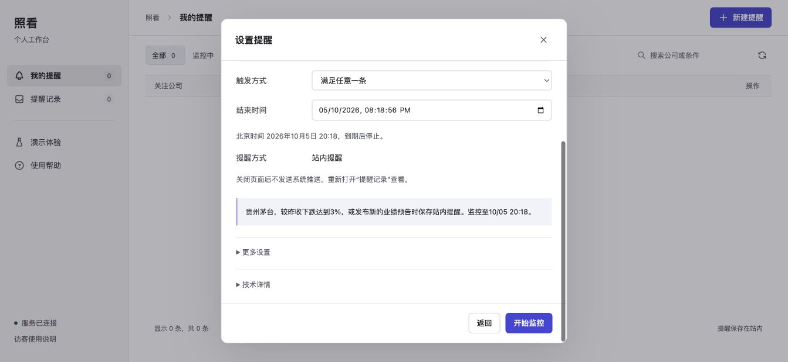
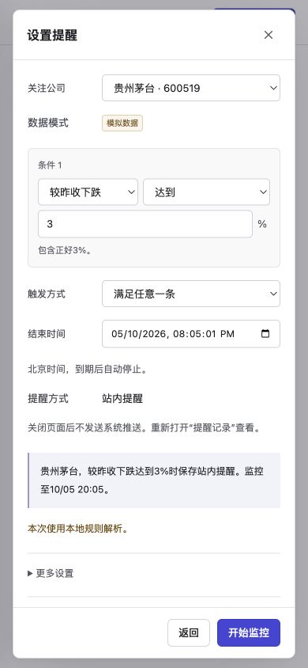

# 照看界面改版验收

核对日期：2026年9月21日。主要读者是检查本次实现的产品和开发协作者。

[打开当前产品](https://intention-water-assistant-comparative.trycloudflare.com/) · [使用指南](USER_GUIDE.md) · [原始验收索引](../artifacts/ux_redesign/native-acceptance.json)

## 已实现的变化

| 页面 | 采用的结构 | 实际修改 |
| --- | --- | --- |
| 我的提醒 | Linear侧栏、页头、筛选与列表的结构 | 去掉宣传口号、雷达装饰和统计卡片；公司、条件、状态及操作直接列出；提供搜索与状态筛选 |
| 新建与设置 | TradingView提醒设置的字段顺序 | 自然语言输入后显示可修改规则；公司、条件、触发方式、结束时间和提醒方式依次核对；频率和原始JSON折叠 |
| 检查记录 | 结果在前，依据随后 | 展示实际值、条件、来源和时间；原始记录折叠；可查看和恢复历史规则 |
| 演示体验 | 单独的模拟操作页面 | 默认黄金示例；触发、重复、公告保留与恢复可连续验证；额外故障折叠，真实任务不能接受注入 |
| 使用帮助 | 按用户动作组织 | 文案使用实际按钮名称，交代站内提醒、访客访问和数据范围；技术资料放在末尾 |

主参考为[Linear官方界面改版](https://linear.app/now/how-we-redesigned-the-linear-ui)和[TradingView提醒设置指南](https://www.tradingview.com/support/solutions/43000595315-how-to-set-up-alerts/)。采用这些资料中的信息层级和操作组织，未复制品牌、代码或整段文案。图标沿用Tabler单一体系，授权与来源保存在`app/web/static/icons/`。

## 实际检查结果

后端回归87项通过，2条既有依赖弃用警告；[输出](../artifacts/ux_redesign/pytest.txt)保留完整摘要。新增10项[显示层测试](../tests/test_presentation.cjs)通过，另在`America/Los_Angeles`时区复跑通过。覆盖涨跌方向、四种比较符号、相等边界、小数转换、原值精度、北京时间转换和生命周期说明。

原生Chrome实际走通了黄金示例的创建与确认：模拟下跌3.8%产生1条提醒，继续跌至4.5%不重复；提醒间隔内的新公告先保留，推进31分钟后生成第2条条件提醒。行情超时显示数据无法判断；来源恢复后继续检查。

在浏览器中把跌幅从3%改为4%，生成第2版，再恢复第1版条件，生成第3版且保留历史。暂停后显示检查已停止，恢复入口可用。公司搜索能区分无结果和代码匹配。

390像素视口中，页面内容宽度为390，规则窗口内部宽度为356，两者均没有横向溢出。手机可打开导航、切换提醒记录及创建提醒。输入公司与补充公司冲突时明确提示，纠正后可以继续生成规则。

公网旧通道曾返回1033，重建后的当前入口已重新验证。真实模型返回`deepseek / deepseek-flash`，页面报告本次6126毫秒；人工确认后成功创建模拟任务，再用模拟跌幅生成1条提醒。该次公网标签的错误日志读取结果为空。模型调用与模拟行情分开说明，本次没有重新跑20条模型评测。

## 本轮修正的边界问题

“下跌达到3%”保留包含相等，“超过3%”保持严格比较。显示转换不改变存储的原始规则值。未触发只表示未达到用户条件，不作市场安全判断。

提醒间隔内确有待提醒公告，才显示“新公告已保留”。只有价格规则等待时显示稍后重新判断。列表的上次判断与当前任务状态分别呈现，暂停不会显示仍在持续检查。

后台刷新错误与用户操作错误分开保存，成功轮询不会清掉操作失败信息。手机收起的导航不接收键盘焦点；展开时背景内容不接收焦点。隐藏的高级输入校验失败会展开其所在区域。

## 截图与视觉范围

截图索引包含改版前页面、空状态、条件确认、故障、逐条件依据、版本和手机界面。实际查看了工作台与规则窗口的图像；其余页面的核对依据包括DOM、操作结果和元素尺寸。没有完成登录参考产品后的同视口、同状态逐像素对照，因此不宣称视觉克隆完成。

## 仍未完成的交付项

v1.0.0视频仍为改版前界面，已经在README和提交清单中标为历史视频。`scripts/record_demo.py`已适配新按钮和正数跌幅，但本轮只做语法检查，没有重录。

`scripts/browser_acceptance.py`已适配新页面并提供可复跑流程，本轮也只做语法检查。本文的浏览器结论来自实际原生Chrome操作，不能写成该脚本全部通过。归档浏览器操作被自动审批拦截，本轮未把它记为浏览器通过；后端归档测试仍通过。

公网仍依赖本机与临时通道，尚未迁移为固定域名的常驻服务。域名更换会产生新的访客标识，旧任务保存在服务器，不会自动迁入新域名会话。
